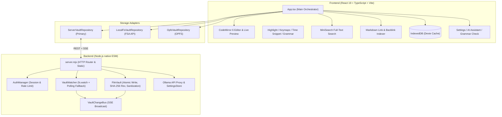
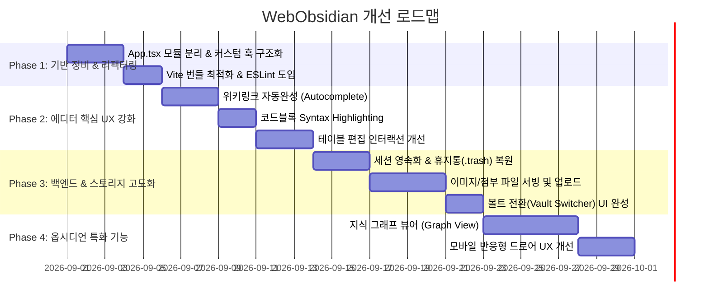

# WebObsidian 프로젝트 심층 분석 및 개선 방안 계획서

본 문서는 **WebObsidian** 프로젝트의 전체 아키텍처, 프론트엔드/백엔드 구현 상태, 에디터 및 스토리지 계층을 면밀히 분석하고, 향후 고도화할 수 있는 영역별 개선 과제와 실행 계획을 정리한 문서입니다.

---

## 1. 프로젝트 현황 및 아키텍처 요약



### 현재 구현 완료된 주요 강점
1. **견고한 서버 파일시스템 볼트 (Model B)**:
   - 임시 파일(`.*.tmp`) 생성 후 원자적 이름 변경(`rename`), SHA-256 기반 충돌 방지(`409 Conflict`), 경로 탈출(`..`) 및 심볼릭 링크 완벽 차단.
2. **실시간 변경 브로드캐스트 (SSE + Watcher)**:
   - `fs.watch` 재귀 감시 및 폴링 폴백, SSE를 통한 다중 브라우저 탭 실시간 동기화.
3. **완성도 높은 인플레이스 라이브 프리뷰**:
   - CodeMirror 6 기반 헤딩, 굵게/기울임/취소선/인라인코드/형광펜(`==`), 콜아웃, 위키링크, 체크박스, YAML 프론트매터, GFM 표 렌더링.
4. **Ollama Cloud AI 통합 & 실시간 맞춤법 검사**:
   - 서버 프록시 기반 안전한 API 키 관리, 스트리밍 채팅, 문장 커밋 기반 자동 띄어쓰기/맞춤법 교정.
5. **체계적인 단위 테스트 커버리지**:
   - 14개 테스트 파일, 118개 단위 테스트 통과 (Happy-DOM 위젯 테스트, 서버 HTTP 목업 테스트 포함).

---

## 2. 영역별 심층 분석 및 개선 기회

### 🔍 A. 옵시디언 핵심 기능 (PKM Core Parity)

| 순번 | 개선 영역 | 현재 상태 | 개선 방안 | 우선순위 |
| :--- | :--- | :--- | :--- | :--- |
| **A-1** | **지식 그래프 뷰 (Graph View)** | 시스템 설계 문서에는 기재되어 있으나 미구현 상태 | `indexer.ts`의 `links` 및 `backlinks` 데이터를 기반으로 `react-force-graph-2d` 또는 D3 Force Layout을 활용한 인터랙티브 2D 노드-엣지 그래프 뷰 컴포넌트 추가 | **중** |
| **A-2** | **위키링크 자동완성 (Autocomplete)** | `[[` 입력 시 수동 입력 필요 | `@codemirror/autocomplete`를 통합하여 `[[` 입력 시 현재 볼트 내 노트 목록 및 서브 헤딩(`[[노트#헤딩]]`)을 팝업 추천하고 자동 삽입 | **상** |
| **A-3** | **미디어/첨부 파일 서빙 및 임베드** | `.md` 파일만 취급하여 이미지 등 첨부 불가 | 서버 Vault에 이미지/첨부 파일 업로드 및 서빙 API(`GET /api/vault/attachment`) 추가, 마크다운 이미지(``) 및 옵시디언 임베드(`![[image.png]]`, `![[Note]]`) 지원 | **상** |
| **A-4** | **전역 명령 팔레트 (Command Palette)** | `Cmd+K`가 검색창 포커스 역할만 수행 | `Cmd+P` 또는 `Cmd+K`로 새 노트, 폴더 생성, 뷰 전환, 설정, AI 도우미 실행 등을 키보드로 바로 실행하는 퀵 팔레트 UI 구현 | **중** |
| **A-5** | **각주(Footnote) 및 KaTeX 수식** | 각주 및 수식 미지원 | `@lezer/markdown` 커스텀 확장으로 `[^1]` 각주 파싱 및 `$수식$` (KaTeX) 라이브 렌더링 확장 | **하** |

---

### 🎨 B. 에디터 및 라이브 프리뷰 고도화 (Editor Experience)

1. **테이블(GFM Table) 편집 인터랙션 개선**:
   - *현상*: 현재 테이블 전체가 단일 `TableWidget`으로 대체되어 있어 셀 내용 클릭 시 테이블 전체가 원문 마크다운으로 전환됨.
   - *개선*: 테이블 포커스 시 활성 셀 인라인 편집 지원 또는 행/열 추가·삭제 보조 툴바 지원.
2. **코드 블록 언어별 구문 강조 (Syntax Highlighting)**:
   - *현상*: `CodeBlockWidget`은 언어 이름 라벨만 띄우고 내부 코드는 단색 텍스트로 표시됨.
   - *개선*: `@codemirror/language-data`를 활용해 js, ts, python, css, json, bash 등 주요 언어의 하이라이트 파서 연동.
3. **스마트 문장 교정 및 줄 번호 추적**:
   - *현상*: `grammarMark.ts`의 `applyGrammarIssues`는 `text.split('\n')` 후 문장 텍스트 일치 여부로 대상을 찾으므로, 본문에 동일한 문장이 반복될 경우 마지막 문장만 수정되는 한계가 있음.
   - *개선*: 에디터의 정확한 커서 위치나 라인 인덱스를 전달받아 교정 적용의 정밀도 향상.

---

### 🏗️ C. 프론트엔드 아키텍처 및 코드 품질 (Frontend Architecture)

1. **`App.tsx` 모놀리스 분리 및 단일 책임 원칙(SRP) 적용**:
   - *현상*: `src/App.tsx` 파일 하나에 **1,056줄**의 코드가 집중되어 있으며, 인증/볼트 IO/드래그앤드롭/단축키/맞춤법 상태/모달 다이얼로그/레이아웃 렌더링이 혼재됨.
   - *개선 구조*:
     ```
     src/
     ├── hooks/
     │   ├── useVault.ts            # 볼트 로드, CRUD, 드래그앤드롭, 활성 노트 관리
     │   ├── useVaultSync.ts        # SSE 구독, 자동 재연결, 외부 변경 리로드
     │   ├── useGrammarChecker.ts   # 맞춤법 검사 상태 및 적용
     │   └── useAppearanceTheme.ts  # 테마 및 글꼴 설정 적용
     ├── components/
     │   ├── layout/
     │   │   ├── Topbar.tsx         # 상단 헤더, 저장 상태, AI/설정/로그아웃 버튼
     │   │   ├── Sidebar.tsx        # 좌측 폴더/노트 트리 탐색기
     │   │   └── Inspector.tsx      # 우측 아웃링크/백링크/태그/맞춤법 패널
     │   └── dialogs/
     │       └── VaultSwitcher.tsx  # 볼트 전환 모달 (Server / Local / OPFS)
     ```
2. **대규모 볼트 지연 로딩 (Lazy Loading) 및 메모리 최적화**:
   - *현상*: 볼트 로드 시 모든 마크다운 파일의 전체 본문(`content`)을 한 번에 읽어와 메모리(`Map<string, VaultDocument>`)에 적재함.
   - *개선*: 초기 목록 조회 시 메타데이터(경로, 제목, 크기, 수정일)만 로드하고, 본문은 노트를 클릭할 때 읽어오도록 지연 로딩(Lazy fetching) 및 캐싱 적용.
3. **명확한 볼트 스위처(Vault Switcher) UI**:
   - *현상*: Local Folder를 열었다가 다시 Server Vault로 돌아오는 UI가 없음.
   - *개선*: 상단 바의 Vault pill 클릭 시 현재 볼트 목록 및 저장소 전환(서버 / 로컬 / 브라우저) 모달 제공.

---

### 🔒 D. 백엔드, 보안 및 데이터 안정성 (Backend & Reliability)

1. **서버 세션 영속화 (Session Persistence)**:
   - *현상*: 현재 세션이 `AuthManager`의 메모리 `Map`에만 저장되어 있어, Docker 컨테이너 재배포나 서버 재시작 시 모든 사용자가 즉시 로그아웃됨.
   - *개선*: 서명 기반 JWT/암호화 세션 쿠키(HMAC-SHA256)를 적용하거나 볼트 내 안전한 세션 파일로 영속화하여 서버 재시작 시에도 7일 유효기간 유지.
2. **휴지통(`.trash`) 및 백업/히스토리 복원**:
   - *현상*: 파일/폴더 삭제 시 파일시스템에서 즉시 `unlink`/`rm`되어 복구 불가.
   - *개선*: 삭제 시 볼트 내 `.trash/` 폴더로 이동시키는 소프트 삭제 옵션 및 휴지통 비우기 기능 추가.
3. **Git 백그라운드 자동 커밋/백업 연동 (선택 옵션)**:
   - *현상*: `SYSTEM_ARCHITECTURE.md`에 설계된 Git 자동 백업 기능 미구현.
   - *개선*: 환경 변수(`WEBOBSIDIAN_GIT_SYNC=true`) 설정 시 파일 저장 후 debounced Git auto-commit 기능 추가.

---

### 📱 E. 모바일 반응형 UX 및 접근성 (Mobile & Responsive UX)

1. **모바일 레이아웃 고도화 (Drawer / Sliding Panel)**:
   - *현상*: 화면 폭 640px 이하 모바일 환경에서 사이드바가 상단 180px 고정 높이 그리드로 배치되어 에디터 공간이 좁아짐.
   - *개선*: 모바일에서는 햄버거 메뉴를 통한 슬라이딩 드로어(Drawer) 또는 하단 탭 내비게이션으로 사이드바/인스펙터를 모달형으로 오버레이.
2. **모바일 가상 키보드 대응**:
   - 모바일 브라우저에서 가상 키보드가 올라왔을 때 에디터 스크롤 영역(`dvh` 단위 활용) 및 상단/하단 툴바 가림 현상 방지.

---

### ⚡ F. 성능, 빌드 및 개발자 환경 (DX & Build)

1. **Vite 번들 청크 분할 (Code Splitting)**:
   - *현상*: `MarkdownEditor` 번들이 639 kB로 500 kB 권장 한도를 초과하여 빌드 경고 발생.
   - *개선*: `vite.config.ts`의 `build.rollupOptions.output.manualChunks` 설정을 통해 CodeMirror 코어, Lezer 파서, Lucide 아이콘, MiniSearch 등을 별도 청크로 분할하여 로딩 속도 최적화.
2. **ESLint & Prettier 린팅 파이프라인 구성**:
   - *현상*: `package.json`에 린트 스크립트가 없어 코드 스타일 일관성 유지에 제약.
   - *개선*: `eslint.config.js` (Flat Config) 및 TypeScript ESLint 설정 추가.

---

## 3. 단계별 추진 로드맵 (Proposed Phased Roadmap)



---

## 4. 사용자 검토 및 결정 필요 사항 (User Review Required)

1. **우선 추진하고 싶은 개선 영역**:
   - **옵션 A (UX/에디터 중심)**: 위키링크 자동완성, 코드 구문 강조, 모바일 드로어 UI
   - **옵션 B (아키텍처/안정성 중심)**: `App.tsx` 리팩터링, 서버 세션 영속화, 휴지통 복구
   - **옵션 C (옵시디언 확장 기능 중심)**: 이미지 첨부 파일 서빙, 2D 지식 그래프 뷰
2. **첨부 파일(이미지) 지원 범위**:
   - 볼트 내 `attachments/` 폴더에 이미지를 저장하고 마크다운에 상대 경로로 자동 삽입하는 표준 방식 채택 여부.

---

## 5. 검증 계획 (Verification Plan)

향후 개선 작업이 진행될 때 적용할 검증 절차:
1. **단위 테스트 (`npm test`)**:
   - 기존 14개 테스트 파일(118개 테스트)의 회귀 방지.
   - 신규 커스텀 훅 및 자동완성/파서 기능에 대한 Vitest 단위 테스트 추가.
2. **빌드 검증 (`npm run build`)**:
   - TypeScript 타입 오류 0건 및 500kB 청크 경고 해소 여부 확인.
3. **실제 환경 수동 검증**:
   - Server Vault, Local Folder, OPFS 각 모드에서의 파일 생성/수정/삭제/이동 검증.
   - 다중 브라우저 탭에서의 실시간 SSE 동기화 및 충돌 방지(409) 동작 확인.
