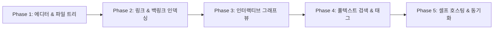

# WebObsidian

서버 폴더에 Markdown 파일을 저장하는 셀프 호스팅 지식 관리 MVP입니다. 현재 구현은 다음 사용자 흐름을 지원합니다.

- 서버 파일시스템 기반 Server Vault 생성과 자동 저장
- 단일 관리자 로그인과 서버 세션 보호
- OPFS 기반 Browser Vault 저장소 구현
- Chromium 계열 브라우저에서 로컬 Markdown 폴더 열기
- CodeMirror 6 커서 기반 인플레이스 라이브 프리뷰와 자동 저장
- 브라우저에 유지되는 테마·글꼴·문서 스타일 설정
- 위키링크, 태그, 백링크 인덱싱
- 제목·본문·태그 검색과 한국어 2-gram 보조 검색
- 설치 가능한 PWA 애플리케이션 셸

## 개발 환경

Node.js 22.12 이상에서 실행합니다.

```bash
npm install
WEBOBSIDIAN_PASSWORD='12자 이상의 비밀번호' npm run server:dev
```

다른 터미널에서 프런트엔드를 실행합니다.

```bash
npm run dev
```

기본 서버 볼트는 프로젝트의 `vault/` 폴더이며 `WEBOBSIDIAN_VAULT_DIR` 환경 변수로 변경할 수 있습니다.

검증 명령은 다음과 같습니다.

```bash
npm test
npm run build
```

CRDT 동기화, Git 백업, Canvas 편집은 MVP 범위에 포함하지 않습니다.

## 모델 B 운영 배포

프로덕션 빌드와 파일 API는 하나의 Node.js 프로세스로 실행됩니다.

```bash
npm ci
npm run build
NODE_ENV=production \
WEBOBSIDIAN_PASSWORD='충분히 긴 운영 비밀번호' \
WEBOBSIDIAN_VAULT_DIR=/srv/webobsidian/vault \
HOST=127.0.0.1 PORT=3000 npm start
```

서버 프로세스가 해당 볼트 폴더를 읽고 쓸 수 있어야 합니다. Nginx 또는 Caddy에서 `127.0.0.1:3000`으로 리버스 프록시하고 HTTPS를 적용하세요.

Docker Compose를 사용하면 저장 파일은 호스트의 `./vault` 폴더에 남습니다.

```bash
mkdir -p vault
export WEBOBSIDIAN_PASSWORD='충분히 긴 운영 비밀번호'
docker compose up -d --build
```

서비스는 보안을 위해 호스트의 `127.0.0.1:3000`에만 바인딩됩니다. 외부 접속은 HTTPS 리버스 프록시를 통해 제공해야 합니다.

로그인은 단일 관리자 비밀번호 방식입니다. 비밀번호는 서버 환경 변수로만 전달되고 브라우저에는 HttpOnly 세션 쿠키만 저장됩니다. 세션은 7일 후 또는 서버가 재시작될 때 만료되며, 동일 클라이언트에서 15분 동안 5회 실패하면 추가 로그인이 일시적으로 차단됩니다.

### 환경 변수

| 변수 | 기본값 | 설명 |
| --- | --- | --- |
| `WEBOBSIDIAN_PASSWORD` | 없음, 필수 | 12자 이상의 관리자 비밀번호 |
| `WEBOBSIDIAN_SECURE_COOKIE` | 운영 모드에서 `true` | HTTPS 전용 세션 쿠키 사용 여부 |
| `WEBOBSIDIAN_VAULT_DIR` | 프로젝트의 `vault/` | Markdown 파일 저장 폴더 |
| `WEBOBSIDIAN_DIST_DIR` | 프로젝트의 `dist/` | 빌드된 정적 파일 폴더 |
| `HOST` | `127.0.0.1` | 서버 바인딩 주소 |
| `PORT` | `3000` | 서버 포트 |

서버는 `.md` 파일만 취급하며 하위 폴더를 지원합니다. 저장할 때 임시 파일을 같은 폴더에 쓴 다음 원본 경로로 교체하고, 클라이언트가 읽은 뒤 서버 파일이 외부에서 변경되었으면 `409 Conflict`로 덮어쓰기를 막습니다.

---

# 기존 설계 가이드

옵시디언(Obsidian)과 같은 로컬 퍼스트(Local-First) 마크다운 기반 개인 지식 관리(PKM, Personal Knowledge Management) 시스템을 웹 서비스로 구현하는 구체적인 아키텍처, 기술 스택, 핵심 알고리즘 및 단계별 구현 방법을 정리한 종합 가이드입니다.

---

## 📌 목차

1. [개요 및 핵심 요구사항 분석](#1-개요-및-핵심-요구사항-분석)
2. [웹 서비스 아키텍처 3대 모델 비교](#2-웹-서비스-아키텍처-3대-모델-비교)
3. [핵심 기술 스택 (Modern Tech Stack)](#3-핵심-기술-스택-modern-tech-stack)
4. [핵심 기능 모듈 상세 설계](#4-핵심-기능-모듈-상세-설계)
   - 4.1 마크다운 에디터 & 라이브 프리뷰 (CodeMirror 6)
   - 4.2 파일 시스템 및 볼트(Vault) 관리
   - 4.3 위키링크(`[[Note]]`) 및 양방향 백링크 인덱서
   - 4.4 인터랙티브 그래프 뷰 (Interactive Graph View)
   - 4.5 풀텍스트 검색(FTS) 및 프론트매터(Frontmatter) 쿼리
   - 4.6 옵시디언 캔버스(`.canvas`) 뷰어
5. [오픈소스 레퍼런스 및 벤치마킹](#5-오픈소스-레퍼런스-및-벤치마킹)
6. [단계별 구현 로드맵 (MVP to Production)](#6-단계별-구현-로드맵-mvp-to-production)
7. [관련 상세 문서](#7-관련-상세-문서)

---

## 1. 개요 및 핵심 요구사항 분석

옵시디언(Obsidian)은 **"내 데이터는 내 컴퓨터의 일반 마크다운 파일로 영구 보관된다"**는 철학 위에 구축된 도구입니다. 이를 웹 서비스로 구현할 때 만족해야 하는 핵심 특성은 다음과 같습니다:

1. **플레인 텍스트(Plain-text) 호환성**: 모든 노트는 표준 `.md` 파일 형태로 유지되어야 하며, 종속적인 바이너리 포맷에 갇히지 않아야 합니다.
2. **양방향 링크(Bidirectional Linking)**: `[[노트 이름]]` 또는 `[[노트 이름|별칭]]` 형태의 위키링크 문법과 이를 역방향으로 추적하는 백링크(Backlink) 기능.
3. **지식 그래프 시각화(Graph View)**: 노트 간의 참조 관계를 노드와 엣지로 시각화하는 Force-directed 그래프.
4. **라이브 프리뷰(Live Preview / In-place Rendering)**: 마크다운 소스 모드와 뷰어 모드를 번갈아 볼 필요 없이 커서 위치에 따라 즉시 렌더링되는 편집 환경.
5. **초고속 검색 & 오프라인 퍼스트**: 수천 개의 노트에서도 딜레이 없는 실시간 풀텍스트 검색 및 네트워크 단절 시에도 끊김 없는 편집.

---

## 2. 웹 서비스 아키텍처 3대 모델 비교

웹 환경에서 옵시디언을 구현할 때는 운영 목적과 인프라 구성에 따라 3가지 아키텍처 중 하나를 선택합니다.

| 분류 | 모델 A: 순수 브라우저 로컬 퍼스트 (PWA) | 모델 B: 셀프 호스팅 클라우드 웹 (Self-Hosted) | 모델 C: 실시간 동기화 협업 웹 (CRDT Hybrid) |
| :--- | :--- | :--- | :--- |
| **작동 원리** | 브라우저의 `File System Access API`로 사용자 PC의 폴더를 직접 읽고 쓰기 | 서버(Docker/VPS)의 파일시스템에 볼트를 두고 Web/REST/WS로 제어 | 브라우저 로컬 DB(IndexedDB) + 원격 서버가 CRDT(Yjs)로 양방향 동기화 |
| **서버 필요 여부** | ❌ 불필요 (정적 웹 호스팅만으로 동작) | ⭕ 백엔드 서버 필수 (Node.js/Go/Rust) | ⭕ 동기화 릴레이 서버 필요 (WebSockets) |
| **데이터 소유권** | 100% 사용자 로컬 PC | 셀프 호스팅 서버 | 로컬 + 중앙 서버 동시 보관 |
| **장점** | 서버 비용 0원, 완벽한 보안, 기존 옵시디언 볼트 폴더 그대로 열기 가능 | 모바일/타 PC 웹 브라우저에서 언제든 접속 가능 | 다중 기기 실시간 동시 편집 및 오프라인 완벽 지원 |
| **단점** | Safari/모바일 브라우저의 File System API 지원 제한 | 서버 운영 및 백업 관리 필요 | CRDT 충돌 관리 및 파일 동기화 구조의 복잡성 |
| **대표 사례** | Bangle.io, Markside | SilverBullet, Foam Web | Logseq Web, AFFiNE |

---

## 3. 핵심 기술 스택 (Modern Tech Stack)

### Frontend (웹 클라이언트)
- **Framework**: Next.js 15+ (App Router) 또는 Vite + React 19 / Svelte 5
- **Editor Engine**: **CodeMirror 6** (옵시디언 자체도 CM6 기반으로 제작됨. 상태 관리와 Lezer 파서 생태계가 마크다운 실시간 렌더링에 최적)
- **Graph Visualization**: `force-graph` / `3d-force-graph` (D3.js Force Simulation 기반의 Canvas/WebGL 렌더러)
- **Markdown AST & Parsing**: `unified`, `remark-parse`, `remark-gfm`, `remark-wiki-link`, `gray-matter` (Frontmatter 파싱)
- **Local Storage / Cache**: `Dexie.js` (IndexedDB Wrapper), OPFS (Origin Private File System)
- **Client Full-Text Search**: `MiniSearch` 또는 `FlexSearch` (한글 자모/N-gram 분해 검색 지원)

### Backend (셀프 호스팅 / 동기화 선택 시)
- **Server Runtime**: Node.js (Fastify) 또는 Go (Fiber) / Rust (Axum)
- **Realtime Sync / CRDT**: `yjs`, `y-websocket`, `y-indexeddb`
- **File Watcher**: `chokidar` (서버 상의 마크다운 파일 실시간 변경 감지 및 웹소켓 브로드캐스트)
- **Git Auto Sync**: `simple-git` 또는 `isomorphic-git` (노트 저장 시 자동 커밋 & GitHub/GitLab 원격 푸시)

---

## 4. 핵심 기능 모듈 상세 설계

### 4.1 마크다운 에디터 & 라이브 프리뷰
- **CodeMirror 6 확장(Extension) 아키텍처**를 활용하여 다음과 같은 데코레이션을 구현:
  1. `[[위키링크]]` 텍스트를 파란색 클릭 가능한 위젯 뱃지로 치환 (커서가 닿으면 raw 텍스트로 노출).
  2. `- [ ]` 체크박스를 인터랙티브 HTML `<input type="checkbox">`로 실시간 치환.
  3. `> [!NOTE]` 콜아웃 블록 데코레이션.
  4. KaTeX 수식(`$...$`, `$$...$$`) 및 Mermaid 다이어그램 실시간 렌더링.

### 4.2 파일 시스템 및 볼트(Vault) 관리
- **File System Access API (`showDirectoryPicker`)**:
  - 사용자가 선택한 폴더의 `FileSystemDirectoryHandle`을 획득하여 트리 구조를 재귀적으로 스캔.
  - 파일 생성(`getFileHandle(name, {create: true})`), 수정(`createWritable()`), 삭제, 이름 변경 지원.
  - 가상 파일 트리(Virtual File Tree UI)를 통해 대규모 볼트(10,000+ 파일)에서도 가상 스크롤 렌더링.

### 4.3 위키링크 및 양방향 백링크 인덱서
- 정규식 또는 AST(mdast)를 통해 모든 파일 내의 `[[노트명]]`, `[[노트명|별칭]]`, `[[노트명#헤딩]]` 추출.
- **인메모리 그래프 데이터베이스** 구축:
  - `ForwardLinks: Map<SourceFile, Set<TargetFile>>`
  - `BackLinks: Map<TargetFile, Set<SourceFile>>`
  - 파일이 저장될 때마다 해당 파일의 링크를 diff 계산하여 그래프 인덱스를 실시간 갱신.

### 4.4 인터랙티브 그래프 뷰 (Interactive Graph View)
- 노드(Node: 마크다운 파일/태그)와 엣지(Edge: 위키링크)로 구성된 데이터셋 생성.
- `d3-force` 물리 엔진을 통한 반발력(charge), 링크 거리(distance), 중심 인력(center) 계산.
- 검색어 필터링, 폴더별/태그별 색상 그룹핑, 고립된 노드(Orphan Nodes) 숨김/표시 옵션 제공.

### 4.5 풀텍스트 검색 및 메타데이터 쿼리
- **MiniSearch**를 브라우저 메모리에 로드하여 제목, 본문, 태그, 프론트매터 필드 인덱싱.
- Dataview 플러그인과 유사한 프론트매터 쿼리 기능(예: `TABLE file.name, tags WHERE status = "doing"`) 파서 구현.

---

## 5. 오픈소스 레퍼런스 및 벤치마킹

1. **[SilverBullet](https://github.com/silverbulletmd/silverbullet)**
   - 브라우저 중심의 PWA 아키텍처. CodeMirror 6 + Preact + Rust 백엔드.
   - 로컬 퍼스트 캐싱과 Space Lua 기반의 프로그래머블 확장성 제공.
2. **[Logseq](https://github.com/logseq/logseq)**
   - Datascript 기반의 아웃라이너 겸 마크다운 그래프 노트 시스템. Local-First 웹/데스크톱 표준.
3. **[Quartz v4](https://github.com/jackyzha0/quartz)**
   - 옵시디언 볼트를 정적 웹사이트로 변환해주는 프레임워크. AST 파싱 및 Fast Search, Graph View 구현 방식 참고에 최적.
4. **[Bangle.io](https://bangle.io)**
   - File System Access API를 이용해 순수 브라우저 상에서 로컬 마크다운 디렉토리를 열어 편집하는 대표적 웹 에디터.

---

## 6. 단계별 구현 로드맵 (MVP to Production)



1. **Phase 1 (기본 볼트 에디터)**: Next.js/Vite + CodeMirror 6 + File System Access API로 로컬 폴더 읽기/쓰기 구현.
2. **Phase 2 (지식 연결)**: 위키링크 구문 분석, 링크 자동완성(Autocomplete 팝업), 백링크 패널 구현.
3. **Phase 3 (시각화)**: D3 / Canvas 기반 Force-Directed Graph View 및 노드 인터랙션(클릭 시 해당 노트 열기).
4. **Phase 4 (검색 및 확장)**: MiniSearch 한글 형태소/N-gram 검색, YAML Frontmatter 파싱, 태그 탐색기.
5. **Phase 5 (배포 및 동기화)**: Docker 컨테이너 패키징, Git 자동 백업, PWA 오프라인 지원.

---

## 7. 관련 상세 문서

- [시스템 아키텍처 상세 명세서 (SYSTEM_ARCHITECTURE.md)](file:///Users/sean/Workspace/WebObsidian/SYSTEM_ARCHITECTURE.md)
- [핵심 기능 모듈별 구현 코드 가이드 (CORE_IMPLEMENTATION_GUIDE.md)](file:///Users/sean/Workspace/WebObsidian/CORE_IMPLEMENTATION_GUIDE.md)
- [프로젝트 스타터 템플릿 & 디렉토리 구조 (PROJECT_STARTER_TEMPLATE.md)](file:///Users/sean/Workspace/WebObsidian/PROJECT_STARTER_TEMPLATE.md)
