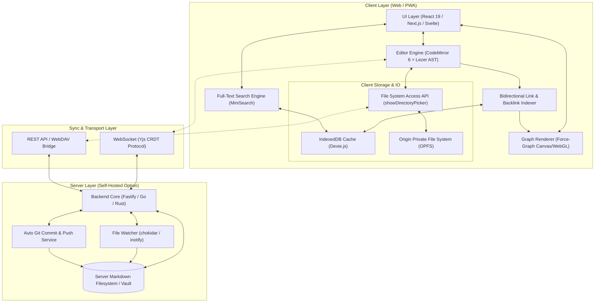
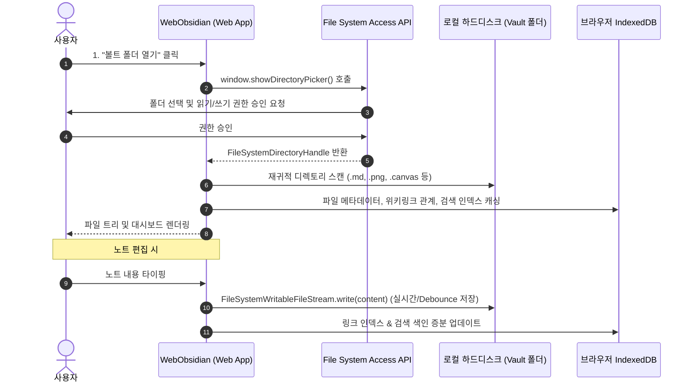
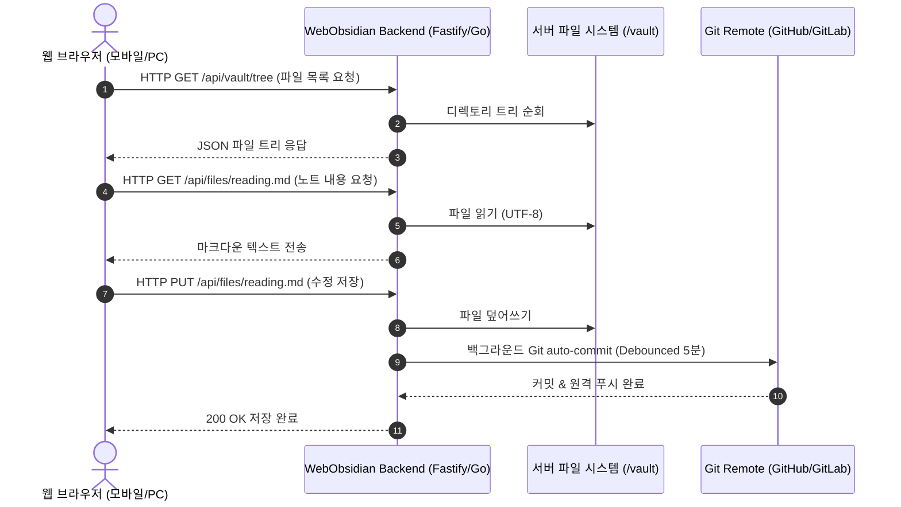

# WebObsidian 시스템 아키텍처 및 상세 설계

본 문서는 Obsidian의 핵심 가치(Local-First, Plain-Text Markdown, Bidirectional Linking, Knowledge Graph)를 웹 환경에서 완벽히 재현하기 위한 시스템 아키텍처, 데이터 흐름, 스토리지 구조, 동기화 메커니즘을 상세히 다룹니다.

---

## 1. 시스템 전체 아키텍처 다이어그램



---

## 2. 3가지 구현 방식별 상세 데이터 흐름

### 방안 1: 순수 브라우저 로컬 퍼스트 (Browser Native Local-First)

사용자의 로컬 디렉토리에 있는 Markdown Vault 폴더를 브라우저가 직접 마운트하여 동작합니다.



#### 기술적 특징 및 제약사항
- **장점**: 
  - 서버를 전혀 거치지 않으므로 데이터 유출 위험 0%, 비용 0원.
  - 기존 데스크톱 Obsidian에서 쓰던 볼트 폴더를 웹 브라우저에서 그대로 열어서 사용 가능.
- **제약 및 해결책**:
  - Safari 및 iOS WebKit은 `showDirectoryPicker`를 지원하지 않음.
  - **대안 (Fallback)**: 모바일/Safari 환경에서는 `OPFS`(Origin Private File System) 또는 `IndexedDB`에 저장하고, 사용자가 필요할 때 `.zip` 파일로 내보내기/가져오기(Export/Import)를 지원하거나 WebDAV 동기화를 활성화함.

---

### 방안 2: 셀프 호스팅 클라우드 웹 (Self-Hosted Cloud Web)

NAS, 홈서버, 라즈베리 파이, VPS에 Docker 컨테이너를 띄우고, 서버의 파일 디렉토리를 마크다운 볼트로 사용하는 방식입니다.



#### 주요 특징
- 사용자는 PC, 태블릿, 스마트폰 등 어디서나 URL에 접속하여 동일한 노트를 열람/편집.
- 서버 측의 `chokidar` 파일 감시기를 통해 외부(예: 데스크톱 Obsidian이 Syncthing이나 Git으로 파일을 바꿨을 때) 변경 사항을 웹소켓으로 브라우저에 즉시 푸시.

---

### 방안 3: CRDT 기반 실시간 동기화 (Hybrid Real-Time Sync)

`Yjs`와 `y-websocket`, `y-indexeddb`를 결합하여 오프라인 편집과 다중 기기 실시간 동시 수정을 지원하는 아키텍처입니다.

```mermaid
graph LR
    subgraph Device A (Client)
        YDocA[Y.Doc A] <--> Y_IDB_A[y-indexeddb]
        YDocA <--> EditorA[CodeMirror 6]
    end

    subgraph Sync Server
        YServer[Y-Websocket Server] <--> VaultStorage[(Markdown File Exporter)]
    end

    subgraph Device B (Client)
        YDocB[Y.Doc B] <--> Y_IDB_B[y-indexeddb]
        YDocB <--> EditorB[CodeMirror 6]
    end

    YDocA <==>|WebSocket Sync Step 1 & 2| YServer
    YDocB <==>|WebSocket Sync Step 1 & 2| YServer
```

- **CRDT(Y.Text)**: 두 기기에서 동시에 같은 문장을 수정해도 충돌(Conflict) 파일 없이 수학적으로 일관된 최종 텍스트로 자동 병합.
- **Markdown 디스크 덤프**: Yjs 상태 벡터를 주기적으로 플레인 마크다운 텍스트로 변환하여 파일시스템에 기록.

---

## 3. 데이터 모델 및 스키마 설계

### 3.1 메모리 내 그래프 인덱스 (Graph Index Structure)

```typescript
// 파일 노드 정보
export interface VaultFileNode {
  path: string;            // 예: "Projects/WebObsidian.md"
  name: string;            // 예: "WebObsidian.md"
  title: string;           // Frontmatter title 또는 파일명(확장자 제외)
  size: number;
  mtime: number;           // 최종 수정 시각 (타임스탬프)
  frontmatter: Record<string, any>; // YAML 메타데이터
  tags: string[];          // #태그 목록
  outlinks: WikiLink[];    // 이 파일이 가리키는 링크 목록
  backlinks: string[];     // 이 파일을 가리키는 파일 경로 목록
}

// 위키링크 구조체
export interface WikiLink {
  target: string;          // 목적지 파일명/경로 (예: "Architecture")
  rawText: string;         // 본문 내 원본 텍스트 (예: "[[Architecture|설계 구조]]")
  alias?: string;          // 표시 별칭 (예: "설계 구조")
  subpath?: string;        // 헤딩 또는 블록 링크 (#Architecture, ^block1)
  line: number;            // 링크가 위치한 라인 번호
}

// 전역 그래프 인덱스 상태
export interface VaultGraphIndex {
  nodes: Map<string, VaultFileNode>; // Key: normalized filePath
  tags: Map<string, Set<string>>;    // Key: tag (#javascript), Value: Set<filePath>
  unresolvedLinks: Map<string, Set<string>>; // 아직 생성되지 않은 대상 링크 추적
}
```

### 3.2 Obsidian Canvas (`.canvas`) JSON 스키마 호환

Obsidian 공식 Canvas 스펙을 준수하여 화이트보드 뷰어를 구현합니다.

```typescript
export interface CanvasData {
  nodes: CanvasNode[];
  edges: CanvasEdge[];
}

export type CanvasNode = 
  | { id: string; type: 'text'; x: number; y: number; width: number; height: number; text: string; color?: string }
  | { id: string; type: 'file'; x: number; y: number; width: number; height: number; file: string; subpath?: string; color?: string }
  | { id: string; type: 'link'; x: number; y: number; width: number; height: number; url: string; color?: string };

export interface CanvasEdge {
  id: string;
  fromNode: string;
  fromSide: 'top' | 'right' | 'bottom' | 'left';
  toNode: string;
  toSide: 'top' | 'right' | 'bottom' | 'left';
  label?: string;
  color?: string;
}
```

---

## 4. 백링크 인덱싱 및 위키링크 해석 알고리즘

### 4.1 위키링크 정규식 및 AST 추출
위키링크는 다음과 같은 문법을 가집니다:
- 기본: `[[노트 이름]]`
- 별칭: `[[노트 이름|표시 텍스트]]`
- 헤딩 참조: `[[노트 이름#특정 섹션]]`
- 블록 참조: `[[노트 이름#^blockId]]`
- 임베드: `![[노트 이름]]` 또는 `![[image.png]]`

```typescript
const WIKILINK_REGEX = /(!?)\[\[([^\[\]\|\#]+)(?:#([^\[\]\|]+))?(?:\|([^\[\]]+))?\]\]/g;

export function extractWikiLinks(markdown: string): WikiLink[] {
  const links: WikiLink[] = [];
  let match: RegExpExecArray | null;

  while ((match = WIKILINK_REGEX.exec(markdown)) !== null) {
    const isEmbed = match[1] === '!';
    const target = match[2].trim();
    const subpath = match[3]?.trim();
    const alias = match[4]?.trim();

    links.push({
      target,
      rawText: match[0],
      alias,
      subpath,
      line: 0 // AST 토크나이저를 사용하면 실제 줄 번호 매핑 가능
    });
  }
  return links;
}
```

### 4.2 링크 퍼지 리졸버 (Fuzzy Link Resolution)
Obsidian은 전체 경로를 적지 않고 `[[Architecture]]`라고만 써도 볼트 내에서 가장 근접한 `docs/Architecture.md` 파일을 찾아 연결합니다.
1. **정확한 경로 매칭**: `Projects/Design.md`
2. **파일명 기준 매칭**: `Design` -> Vault 내의 모든 파일명 중 `Design.md` 검색
3. **가장 짧은 경로 우선순위**: 동일 파일명이 여러 폴더에 있을 경우 루트에 가장 가까운 파일 매핑

---

## 5. 보안 및 권한 모델

1. **클라이언트 보안**:
   - `File System Access API`는 브라우저 보안 정책상 사용자 인터랙션(클릭 등)을 통해서만 권한을 획득할 수 있습니다.
   - 획득한 Handle은 `IndexedDB`에 영구 저장하여 다음 페이지 방문 시 권한 재확인(`handle.queryPermission()`)만 거치면 다시 열 수 있습니다.
2. **셀프 호스팅 백엔드 보안**:
   - **Path Traversal 방지**: 사용자 입력 경로(`../../etc/passwd`)에 대한 strict sanitize 검사 (`path.resolve` 및 vaultRoot 범위 벗어남 감지).
   - **JWT / Session 인증**: 웹 서비스 접근 시 토큰 기반의 인증 및 HTTPS(TLS) 필수 적용.
   - **End-to-End Encryption (E2EE)** (동기화 사용 시): Web Crypto API (`AES-GCM-256`)로 브라우저에서 암호화 후 서버로 전송.
